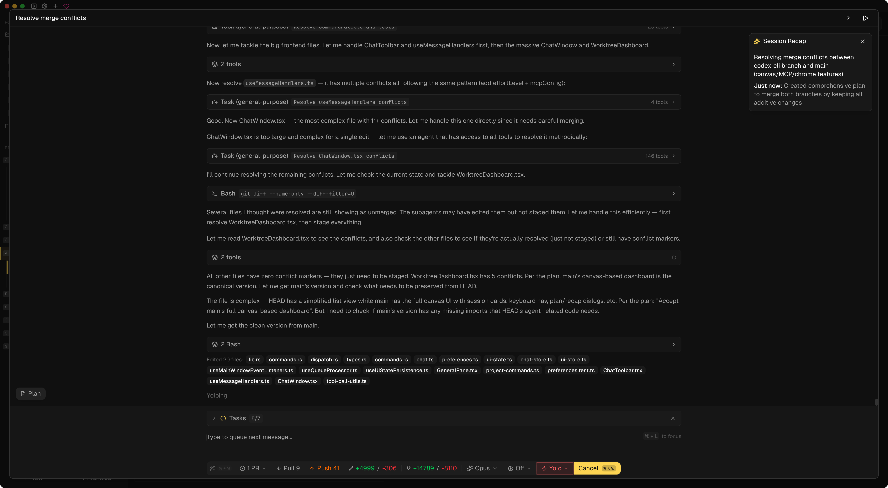
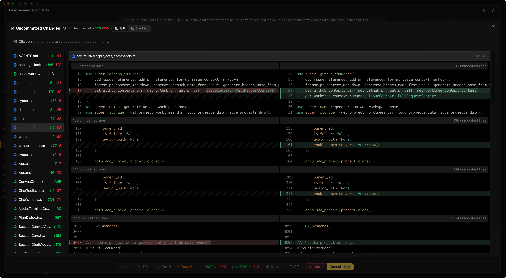
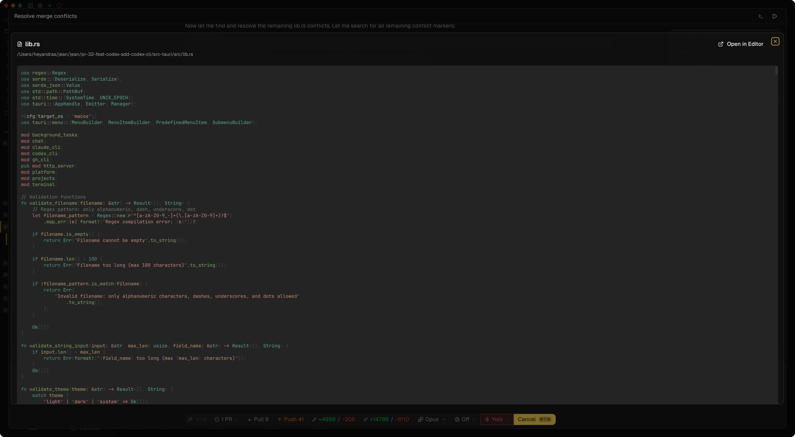

<div align="center">

# Jean

A desktop AI assistant for managing multiple projects, worktrees, and chat sessions with Claude CLI.

Tauri v2 · React 19 · Rust · TypeScript · Tailwind CSS v4 · shadcn/ui v4 · Zustand v5 · TanStack Query · CodeMirror 6 · xterm.js

</div>

## About the Project

Jean is an opinionated native desktop app built with Tauri that gives you a powerful interface for working with Claude CLI across multiple projects. It has strong opinions about how AI-assisted development should work — managing git worktrees, chat sessions, terminals, and GitHub integrations in one cohesive workflow.

No vendor lock-in. Everything runs locally on your machine with your own Claude CLI installation.

For more information, take a look at [jean.build](https://jean.build).

## Screenshots

<table>
<tr>
<td></td>
<td></td>
</tr>
<tr>
<td></td>
<td></td>
</tr>
</table>

## Features

- **Project & Worktree Management** — Multi-project support, git worktree automation (create, archive, restore, delete), custom project avatars
- **Session Management** — Multiple sessions per worktree, execution modes (Plan, Build, Yolo), archiving, recovery, auto-naming, canvas views
- **AI Chat (Claude CLI)** — Model selection (Opus, Sonnet, Haiku), thinking/effort levels, MCP server support, file mentions, image support, custom system prompts
- **Magic Commands** — Investigate issues/PRs/workflows, code review with finding tracking, AI commit messages, PR content generation, merge conflict resolution, release notes
- **GitHub Integration** — Issue & PR investigation, checkout PRs as worktrees, auto-archive on PR merge, workflow investigation
- **Developer Tools** — Integrated terminal, open in editor (Zed, VS Code, Cursor, Xcode), git status, diff viewer (unified & side-by-side), file tree with preview
- **Remote Access** — Built-in HTTP server with WebSocket support, token-based auth, web browser access
- **Customization** — Themes (light/dark/system), custom fonts, customizable AI prompts, configurable keybindings

## Installation

Download the latest version from the [GitHub Releases](https://github.com/coollabsio/jean/releases) page or visit [jean.build](https://jean.build).

### Homebrew (macOS)

```bash
brew tap coollabsio/jean
brew install --cask jean
```

### Building from Source

Prerequisites:

- [Node.js](https://nodejs.org/)
- [Rust](https://www.rust-lang.org/tools/install)
- **Windows only**: In the Visual Studio Installer, ensure the **"Desktop development with C++"** workload is selected, which includes:
  - MSVC C++ build tools
  - Windows SDK (provides `kernel32.lib` and other system libraries required by Rust)

See [CONTRIBUTING.md](CONTRIBUTING.md) for full development setup and guidelines.

## Platform Support

- **macOS**: Tested
- **Windows**: Not fully tested
- **Linux**: Not tested at all

## Roadmap

- Add [Opencode](https://opencode.ai/) support
- Enhance remote web access

## Contributing

See [CONTRIBUTING.md](CONTRIBUTING.md) for development setup and guidelines.

## Core Maintainer

|                                                                                                                                                                            Andras Bacsai                                                                                                                                                                             |
| :------------------------------------------------------------------------------------------------------------------------------------------------------------------------------------------------------------------------------------------------------------------------------------------------------------------------------------------------------------------: |
|                                                                                                                                                                                                                                                                                   |
| <a href="https://github.com/andrasbacsai"></a> <a href="https://x.com/heyandras"></a> <a href="https://bsky.app/profile/heyandras.dev"></a> |

## Philosophy

Learn more about our approach: [Philosophy](https://coollabs.io/philosophy/)

## Star History

[](https://star-history.com/#coollabsio/jean&Date)
